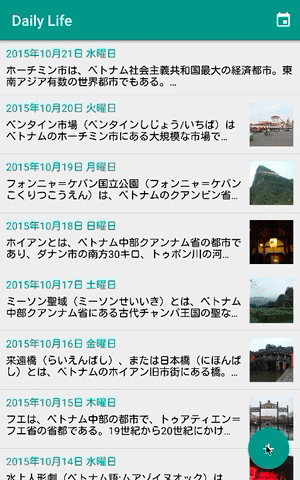
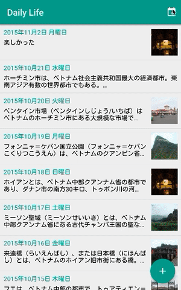

# アプリ紹介

#### 日記一覧

アプリケーションを立ち上げると最初に表示される画面です。<br /> 
これまでに作成したすべての日記がリスト形式で表示されます。<br /> 
リストから見たい日記を選択すると、日記詳細へ遷移します。


#### 日記作成

日記一覧画面の右下にある「＋」ボタンをタップすると日記作成画面が表示されます。<br /> 
日記には画像を１枚だけ添付することができます。<br /> 
日記内容を記載して、「保存」ボタンをタップすると日記が作成されます。



#### 日記詳細

日記一覧画面のリストを選択すると、日記詳細へ遷移します。<br /> 
日記に画像が投稿されている場合、日記詳細の先頭に画像が表示されます。<br /> 
画像をタップすると、画像のみが表示されます。画像は拡大縮小することができます。


#### カレンダー機能

日記一覧画面の右上にあるカレンダーアイコンをタップするとカレンダーのダイアログが表示されます。<br /> 
本日の日付が緑の円で囲まれています。すでに投稿されている日付は緑色の文字でハイライトされています。<br /> 
ハイライトされた日付をタップすると、日記詳細へ。ハイライトされていない日付をタップすると日記作成へ遷移します。




# アプリ紹介動画の作成方法

#### 動画の作成

QuickTime Player で、Android（Genymotion）の動画を作成する 

参考
http://tokyo.secret.jp/macs/mt-quicktime-rec.html


#### GIFの作成方法


```
ffmpeg -i create.mov -vf fps=20,palettegen=stats_mode=diff -y create-palette.png
ffmpeg -i create.mov -i create-palette.png -lavfi fps=20,paletteuse -y create-ffmpeg-palette.gif
```

参考
http://genjiapp.com/blog/2015/05/05/generating-much-better-animated-gif-from-movie-file.html
